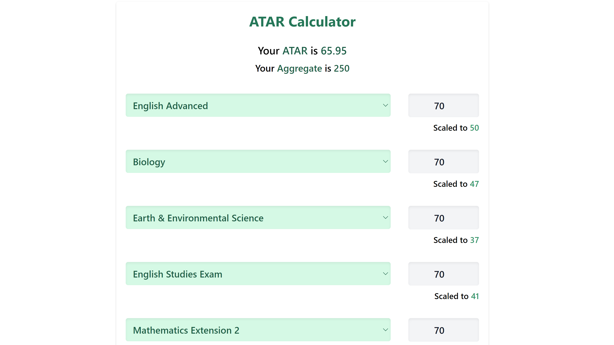

> My ATAR Calculator's algorithm was built from scratch using JS. The app was 
> created using Next.js and was styled using TailwindCSS. This is a prototype
> for a start-up I'm working on. I decided to release it as a standalone app
> for user testing.

&nbsp;
 

